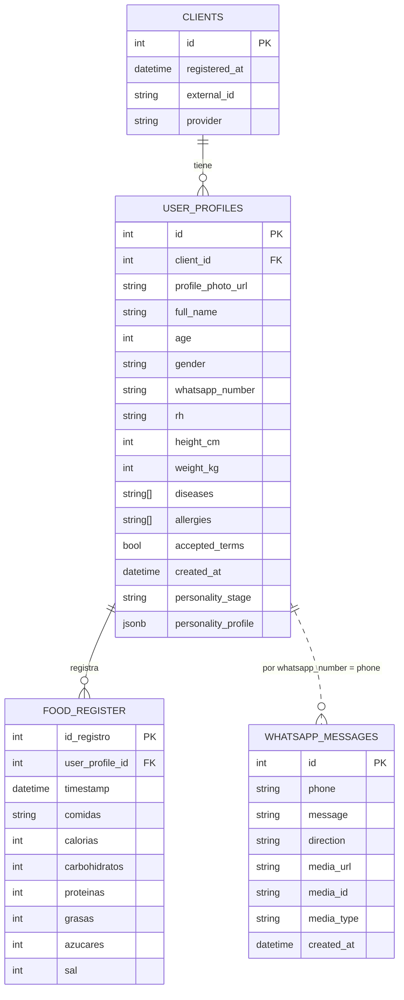
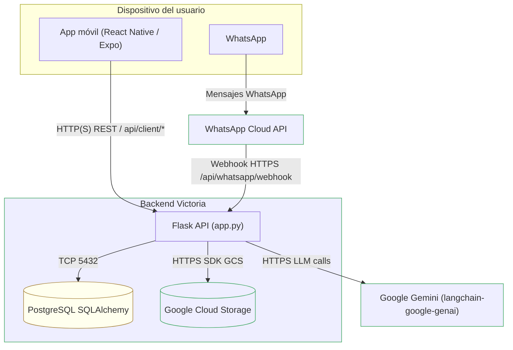
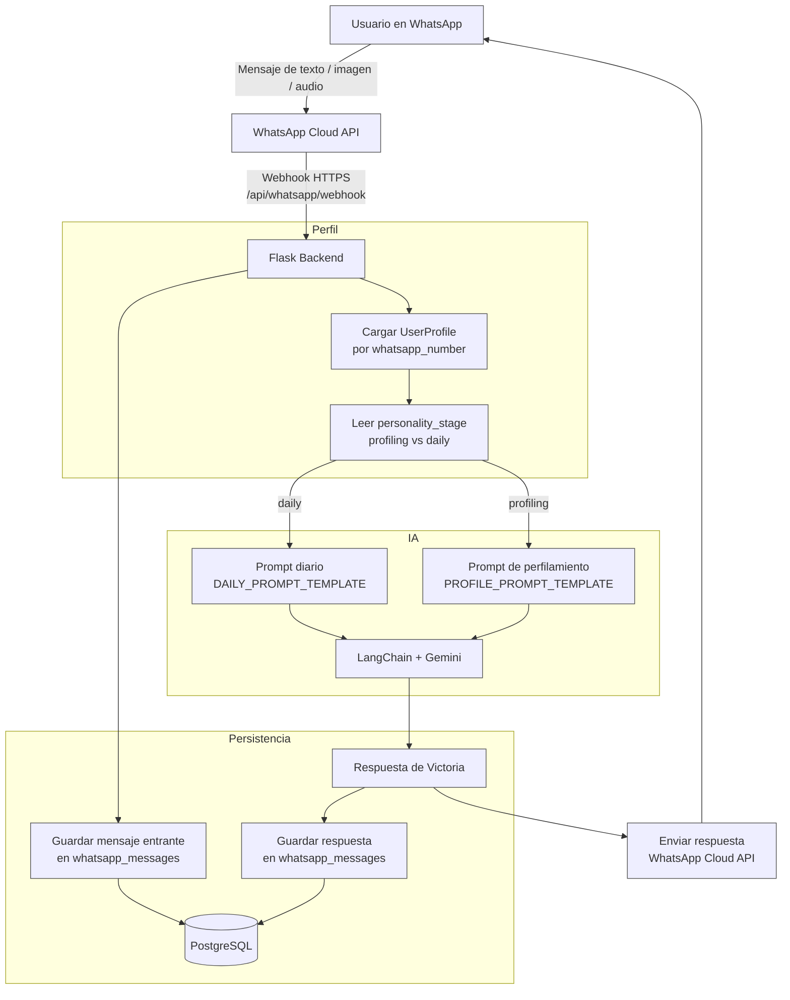

# VictorIA - Digital Care

Asistente de nutrición y bienestar que acompaña al usuario mediante WhatsApp y una app móvil.

- **Frontend:** React Native (Expo, TypeScript)
- **Backend:** Python + Flask + SQLAlchemy + PostgreSQL
- **IA:** Google Gemini (via `langchain-google-genai`) + LangChain
- **Mensajería:** WhatsApp Cloud API
- **Almacenamiento:** Google Cloud Storage
- **Infraestructura:** Docker, docker-compose, despliegue en VM (GCP). 

---

## Arquitectura general

- **App móvil (frontend):**
  - Construida con **React Native + Expo + TypeScript**.
  - Registro de perfil de usuario (datos clínicos + foto).
  - Dashboard y reportes nutricionales.

- **Backend Flask:**
  - API REST para:
    - Registro de clientes y perfiles (`/api/client/register`).
    - Webhook de WhatsApp (`/api/whatsapp/webhook`).
    - Historial de mensajes (`/api/whatsapp/messages/:phone`).
  - Procesa mensajes entrantes y salientes de WhatsApp.
  - Usa **LangChain + Gemini** para generar respuestas contextuales.
  - Guarda mensajes y perfiles en **PostgreSQL**.
  - Guarda hechos importantes usando una base de datos vectorial **ChromaDB** para memoria a largo plazo usando el modelo de embeddings de Gemini.

- **IA conversacional (Victoria):**
  - Fase 1: *Test de personalidad y hábitos* (perfilamiento).
  - Fase 2: *Seguimiento diario* usando el perfil aprendido.
  - Maneja memoria de conversación por usuario con LangChain, comprimiendo los tokens para mantener una memoria a corto plazo.

---

## Stack tecnológico

### Frontend
- React Native (Expo)
- TypeScript
- React Navigation
- AsyncStorage

### Backend
- Python 3.11
- Flask + Flask-CORS
- SQLAlchemy + PostgreSQL
- LangChain + `langchain-google-genai`
- Google Cloud Storage SDK
- Docker + docker-compose

### Integraciones externas
- **WhatsApp Cloud API** (mensajería)
- **Google Gemini** (LLM)
- **Google Cloud Storage** (medios de usuario)

---

## Diagrama de base de datos



> [Ver modelo](https://mermaid.live/edit#pako:eNqFVGFv2jAQ_SuWP1MEHQESaR9QGzrUbkWEadLGFJn4SLw6dmQ7aynlv88hhJGEdfkQxe_57ux397LDkaSAPQzqlpFYkXQlkH1uHmb-l2WAduUSISYMYhTN7yuAEgOGpYAUxEwbUEBDYipWG8VEjODFEoLwkNEGkyn5m1FQJbxfifLja-AvwvnicTp78N-rXgARZyCMTY2m9-3sG8YhzBJpZJgr3uA3OeehICmc5yMxNLbFIE5HPIHPCTGaZFko8nTdYlVynjIBFicmjNJz8LkEn-J66I-fiDINRINuEYRzUDH7y6yl5IhEEWTG6m5FTnWrMZECYi51JQOlpe0KM9tQm7Nr_7LwukYfhWx06dunyTKYzOfhZz8IJnfvdqqqmUjRlDcFrduiU6YgMkyK1m7KyIVelnhrwErYbDP4rzCne00fH2_DhX83C5b-onmnsBx0JRtjmGtQlU71YTwVLF5W6DRrnDGSKaNE14aacKlYE1NrmTCqiJE1wlY1wER9tzWxriPkNbcpoIZpwhuXryz_9nZ1JXcNJ3pohY21G6zwJaMeY-r6FTFHzci_wrpdG9YepyI0k6rpNfTxOEcYd3CsGMWeUTl0cGoNQIolPjTNnjUBa25c5KFEPRXl9zYmI-K7lGkVpmQeJ9jbEK7tKs-Khh1_gydUHf4BNzIXBnv90SEH9nb4BXsf-tfdvnPtDgY9p--O3GEHby067g5c1x33-sOh4wxcZ9_Br4eive545Oz_AG6iuTw)

---

## Diagrama de tecnologías y protocolos de comunicación



> [Ver modelo](https://mermaid.live/edit#pako:eNp9VO1umzAUfRXL_ZNOJGkhpIRKk5LQddXaKSvZIi3shwsGvDg2wqZpVvWp9gh7sV0D-WilDQm49j3n3nOvP55xLBOKfZxyuYlzUmo0DyKB4FHVQ1aSIkdfFS0D-shiugyYKqRimj1KlFCOKlWRkskfDcM846JYRhi-aP3n9yPjqHNPSazRZwIkivro6qmQpxE-oizGDWmRE63A3DupSCLxRsyExCuYX7Z_9I3FWpaMHEuY3UC0D5yolbFRhxRFr9i-ThpMlp0Iz6TSWUnDL7cI3jGPc7reRvj0CHg9DQ3yWsqMUzTlskpQCClJRg_AI6XXdM0EW-4ZzRh1OBEZNJiJblY7uhkVhB1ELcbTox60iUB-DWggZr7bRRH-OJ_POuEpur8K59BSUrB-zBkVuv8uwgB5XxNF24yGM5_OkDtw7BYQTN74TcwQhcEnU3ELMpbYydtnv6NCkZ9UocOC1WioYF9Kg1zQh1zKFWpi943OjeHAgvQ3je-fehvO7e0dignnaqeo7uZOVAxrrAKagmG6lTLO_RNKU0vpUq6ofzIgw9bubliic_-8eLp8w00eWmKa0j2ReIP_Enf70AomFnTJanRZpvJayytsMIEkl9jCWckS7OuyohZe03JNzBA_G2yENew92FI-mAkpoTGReAFOQcR3Kdc7WimrLMd-SriCUVUkRNOAETgcBwjoouVUVkJjf1RHwP4zfsK-fe703KHt2vbQu3C94YVr4S1g3J4zurA9Z-TarnG-WPhXnfOsNxyMzpyzke14A8fxHM_CpNIy3Ip4l44mDI7DXXON1LfJy1-Eu1K2)

---

## Diagrama de flujo conversacional (Victoria)



> [Ver modelo](https://mermaid.live/edit#pako:eNqFk29v2jAQxr-K5b3ZNLeQQJYmlSalQDuktM0gDG0JQi4xiQexI9sp7Uq_-5wEaDc6LW_yx_f87u65yxNc8IRAFy7XfLPIsFAg7McM6GsSTWSJBeWAMDDNsJJeUczAycnn7TVhEv8kICFAkQfFQQvQHKc6rgVwmVC-BVMv2mtAb83LBHjBcNaQp15NmZK7jPMV-BKGwTiOWQsXtLWpRLgoWpvmdFvposs1litwgRcrwhJNaTiyvEsFLjIQELGk6-ZjdWlJlQH4QRTDHhYpFmAiiQgE13FE5yq4APtUc1bmd0TEcPZC8IMaMA69q0HkEyJAQYTkDK-pepxLpZutKDWPshTcS5Bgun7cIXSVR0UOvRd8za1NOCC2IDAiXWBeqMrXom4J55QwxXWqYHR7OfQHc32_DsJ5OLgOfC8czN5i1pVonnng0WqOmtL3hv73NxgvlMBonOtFPmZpL8OUgY_giuSU0VfJAnMXdtSv36tPRtr5EZFFSbRZVUPf6EJxQXFt8_H8JJWKsIU-P57i7dXwJrrSu5joOea73dO-CMxUNQa9d4dZ5kRKPRz5qtbRnnI7CQ8Ysa_t__pGWUP6F9H7gEuVCjL-6n_4M2h4s4s58qSpYDy46UcDdk__Sv_P_6QS1MrJHrTQ_4HskyXQZhVAL8jafUfIEkkl-Iq47yzL2j2fbGiiMtcoHs5fScEETT2kMyA_QPXCoMBAgYn8HhqhKh-qG0FNz6h_UWc6hwimgibQVaIkCOZE5Lh6hU8VPIYqIzmJoasftbmrGMbsWWsKzH5wnu9lgpdpBt0lXkv9VhYJVqRPsd6B_PBVaNuI6PGSKeh2OzUDuk_wAbqm-enUtk2n0zWcjmFaZyaCj9C1jFO707Ud07Ha9pnTtZ8R_FVnNU7blmM5Rtuw23a703U6z78BOiOLMw)

---

## Desarrollo local

### 1. Backend

```bash
cd backend
pip install -r requirements.txt
# Crear .env con DATABASE_URL, credenciales de GCP, WhatsApp, etc.
python app.py
```

### 2. Frontend

```bash
cd frontend
npm install
# Configurar BACKEND_BASE_URL en .env o config
npm start
```

---

## Docker / docker-compose

En la raíz del proyecto (`victoria`):

```bash
docker compose up --build
```

Esto levanta:
- `victorias-postgres`: base de datos PostgreSQL.
- `victorias-backend`: backend Flask expuesto en `:5000` (o el puerto que definas).

---

## WhatsApp Cloud API

- Configurar el webhook que apunte a:
  - `https://TU_DOMINIO/api/whatsapp/webhook` o
  - `http://IP_VM:5000/api/whatsapp/webhook` (en entorno de pruebas).
- Definir variables en el `.env` del backend:
  - `WHATSAPP_ACCESS_TOKEN`
  - `WHATSAPP_PHONE_NUMBER_ID`
  - `WHATSAPP_VERIFY_TOKEN`

---

## IA: Fases de Victoria

1. **Perfilamiento (profiling):**
   - Usa datos de `UserProfile` (edad, género, enfermedades, alergias, etc.).
   - Realiza preguntas breves por WhatsApp para conocer gustos, emociones y hábitos.
   - Después de cierto número de mensajes, genera un `personality_profile` estructurado y cambia de fase.

2. **Seguimiento diario (daily):**
   - Usa `personality_profile` + perfil clínico.
   - Hace check-ins diarios (qué comió, cómo durmió, energía, antojos).
   - Propone micro-hábitos y ajustes realistas.

---

## Estructura del repo (resumen)

- `/backend`: API Flask + modelos + lógica de IA y WhatsApp.
- `/frontend`: app móvil Expo/React Native.
- `docker-compose.yml`: orquestación de backend + Postgres.
- `README.md`: este archivo (visión general).
- `backend/README.md`: detalles del backend.
- `frontend/README.md`: detalles del frontend.
